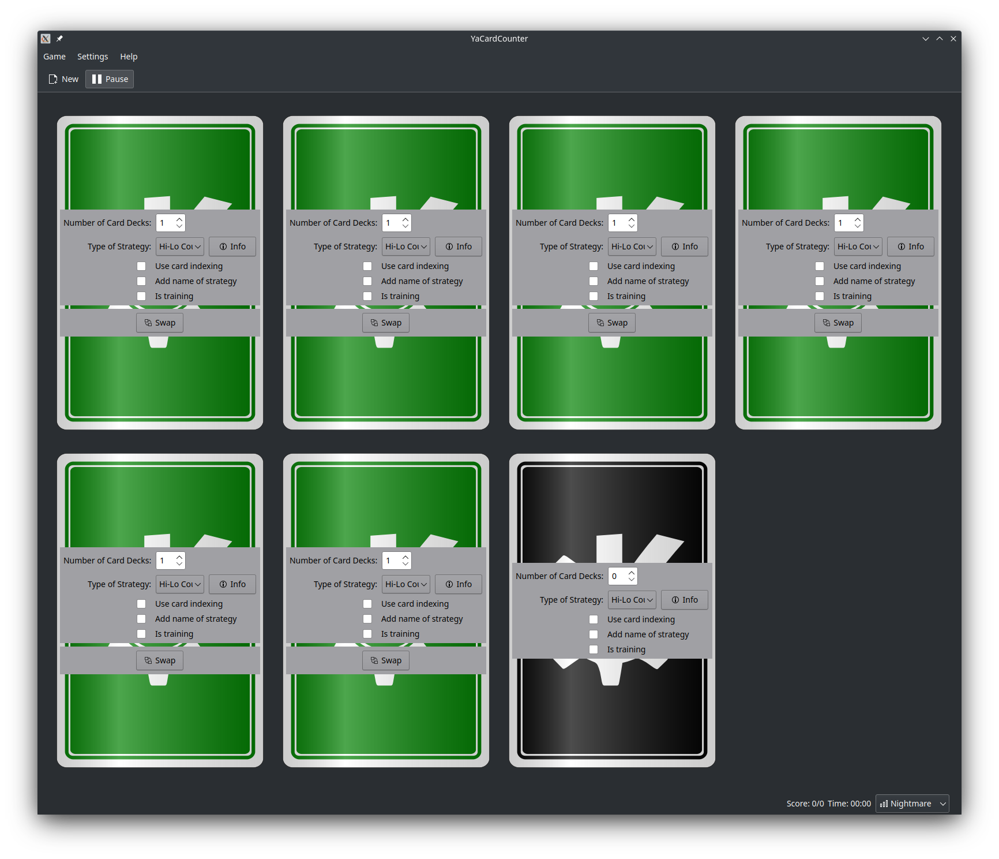
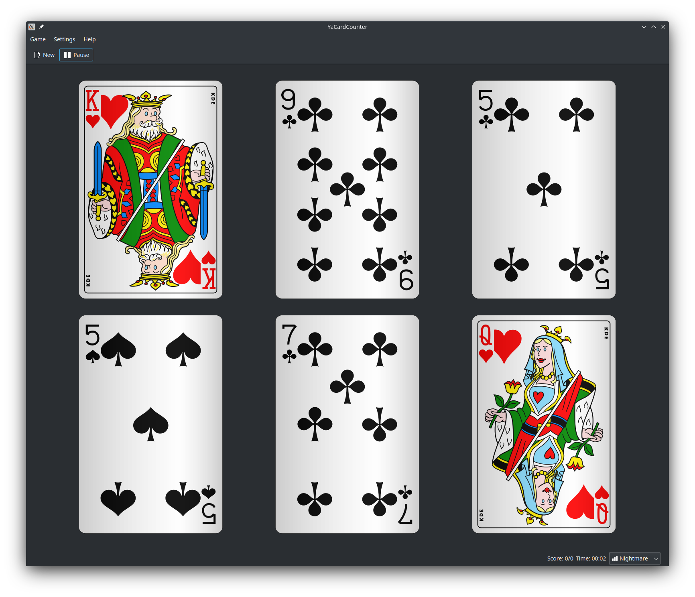
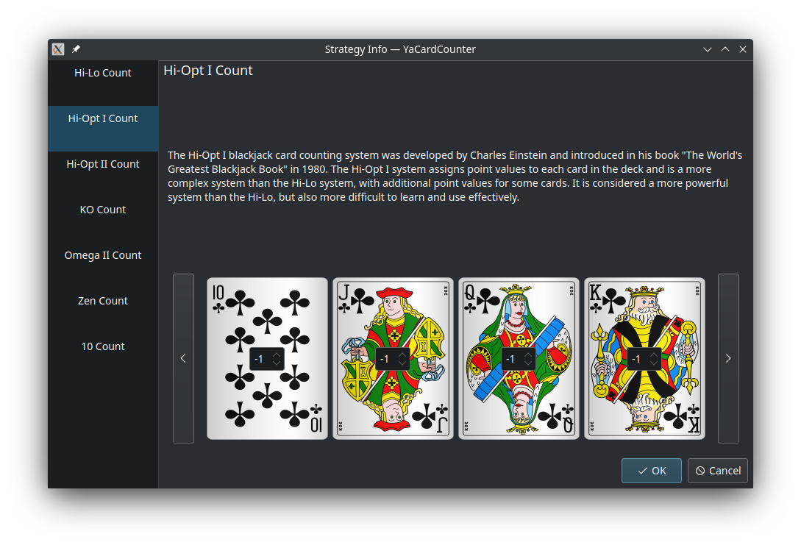

## YaCardCounter


[](https://www.codacy.com/gh/YaCodeLab/YaCardCounter/dashboard?utm_source=github.com&amp;utm_medium=referral&amp;utm_content=YaCodeLab/YaCardCounter&amp;utm_campaign=Badge_Grade)

**YaCardCounter** is an educational game developed and maintained by YaRiabtsev as part
of [YaCodeLab](https://github.com/YaCodeLab) organization. The project aims to improve basic arithmetic skills and
memory retention by counting cards in different table-slots with different strategies. The user has the option to use
one of the preloaded strategies (Hi-Lo, Hi-Opt I, Hi-Opt II, Zen Count and other) or create their own custom strategy.
The game is implemented in C++ with using Qt5, KF5, KF5KDEGames and carddeck packs from kdegames-card-data-kf5.

### Gameplay

|            |  |
|---------------------------------------------------------------------|-------------------------------------------------------------|
|  |

At the beginning of the game, the user customizes the number of table-slots, and for each table-slot, they can choose
the number of standard playing card decks and the strategy. The abstract dealer then picks up one card from one or more
table-slots (depending on the level of difficulty). The user must keep track of the sum of the weight of the cards in
each table-slot, taking into account the weight assigned to each card in the chosen strategy.

If the next picked card is a joker, the user must answer a joker's question to continue playing. The joker card has no
weight and is rare, so answering correctly about the current weight of the table-slot with the joker card changes the
score.

The score is based on the player's ability to answer the joker questions correctly and is measured by the number of
jokers the player has guessed correctly out of the total number of joker questions.

The main focus of the game is to improve arithmetic skills and memory, and the score serves as a motivational tool.

### Contributing

This project is open for contribution from other people who have more knowledge in this area. If you're interested in
contributing, please contact [YaRiabtsev](https://github.com/YaRiabtsev) or open
an [issue](https://github.com/YaCodeLab/YaCardCounter/issues/new/choose) on the GitHub repository.

To get involved/development it is recommended to read the documentation
and [configure the environment](https://community.kde.org/Get_Involved/development) according to the specified steps.

After that, you can use the following commands to install and run:

```bash
cmake -B build/ -DCMAKE_INSTALL_PREFIX=$HOME/kde/usr/
cmake --build build/
cmake --install build/

source build/prefix.sh # located in the build directory
YaCardCounter
```

You can find documentation at [here](https://yacodelab.github.io/YaCardCounter/docs/html/).

### License

This project is licensed under the GNU General Public License v3.0.
